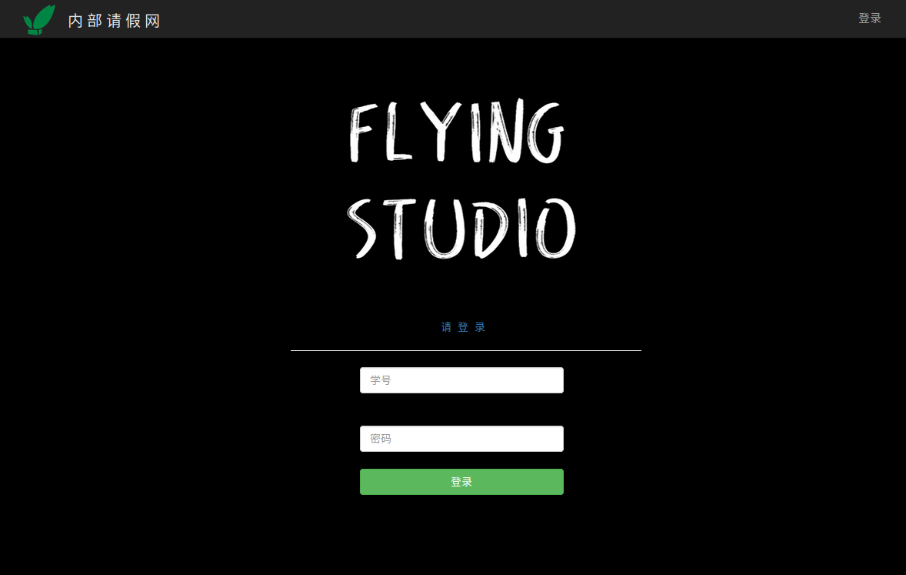
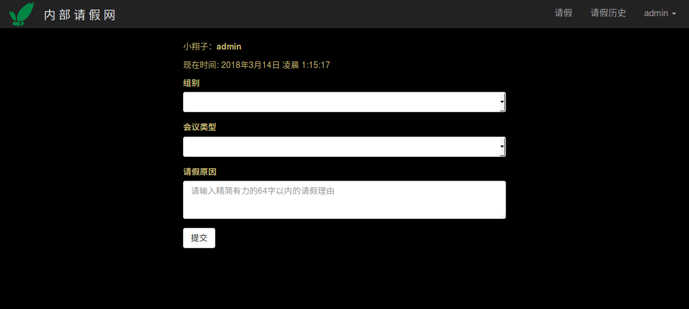

# 工作室内部请假网

## 本地预览

### Docker一键预览

```
docker-compose up -d
```

>访问127.0.0.1:5000即可
(数据库文件挂载在config/data)

### 源码安装

> 依次按以下命令执行

``` stylus
// 创建虚拟环境
$ virtualenv venv
//进入venv\Scripts目录 激活虚拟环境
$ activate
//安装依赖包
(venv)$ pip install -r requirements.txt
//初始化数据库
python manage.py initdb
//进入off_member目录
$ python manage.py runserver
```
> 等待本地浏览页面

# 添加管理员

``` stylus
(venv)$ python manager.py shell
//创建管理员,admin属性一定要设置为True,stu_number要求8位以上
$ admin=User(name='icbtbo',stu_number='21315452',password='123',admin=True)
$ db.session.add(admin)
$ db.session.commit()
```

# 添加组别，会议类型

>命令行添加或者管理员进入后台添加

``` stylus
(venv)$ python manager.py shell
//添加组别
$ group = Grouptype(group='后端组')
$ db.session.add(group)
$ db.session.commit()
//添加会议类型
$ meeting = Meetingtype(group='后端组')
$ db.session.add(meeting)
$ db.session.commit()
```

# 导入用户数据
- 从excel文件中导入
- 所选文件需重命名为 users.xlsx
- 所选文件放在根目录下
- excel文件需注意：
  1.数据放在第一张表中
  2.姓名，学号，密码分别在第一、二、三列
  （具体参见users.xlsx文件)

操作命令：

``` stylus
(venv)$ python manager.py readexcel
//执行导入数据函数
```

**部署的时候记得切换config为生产环境**



